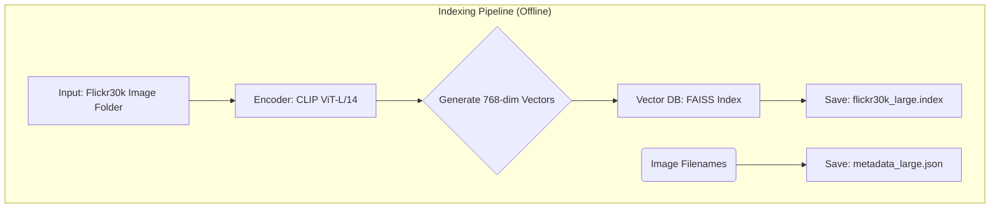

<div align="center">

# A RAG-Based Approach to Image Retrieval and Context-Aware Generation

**Final Project: Advanced Computer Vision (2025)**


A professional implementation of a multimodal Retrieval-Augmented Generation (RAG) pipeline, designed to "see" and "reason" by grounding Large Language Models in visual data.

</div>

---

## 👥 Project Team

**University of Muhammadiyah Malang** *Informatics Engineering Department*

<div align="center">
<table>
<tr>
<td align="center" width="25%">
<br><br>
<strong>Bayu Ardiyansyah</strong><br>
<sub>202210370311025</sub><br>
<em>Core Architecture, Retrieval Logic, Fine-Tuning & Team Support</em>
</td>
<td align="center" width="25%">
<br><br>
<strong>Nadzrul Khair</strong><br>
<sub>202210370311042</sub><br>
<em>Vector DB Optimization (FAISS) & Preprocessing</em>
</td>
<td align="center" width="25%">
<br><br>
<strong>Devi Dian Aprilia</strong><br>
<sub>202210370311461</sub><br>
<em>Academic Metrics Implementation (BLEU/ROUGE)</em>
</td>
<td align="center" width="25%">
<br><br>
<strong>Divani Salsabila</strong><br>
<sub>202210370311288</sub><br>
<em>Streamlit Integration & Documentation</em>
</td>
</tr>
</table>
</div>

---

## 🏛️ System Architecture & Data Workflow

The system operates in two distinct phases: 1. One-Time Indexing (offline) and 2. Real-Time Inference (online).

### 1. Indexing Pipeline (Offline)

This process is run once to build the vector database. All images from the Flickr30k dataset are converted into high-dimensional vectors using the CLIP encoder and stored in a FAISS index for rapid lookup.



### 2. Inference Pipeline (Real-Time RAG)

This is the live workflow executed when a user submits a query. The system retrieves relevant images, translates them into text context using a **Fine-Tuned BLIP-2 Adapter**, and generates a final answer.


---

## ⚙️ Final Project Compliance & Technology Stack

This project strictly adheres to the **Advanced Computer Vision Final Project Requirements**. The table below details how each required component is implemented and verified.

| No. | Requirement Component | Implementation / Technology Used | Compliance |
| --- | --- | --- | --- |
| **1** | **Dataset** (Public like COCO/Flickr) | **Flickr30k** (Standard Benchmark) | ✅ |
| **2** | **Feature Extraction** (CLIP/ViT + FAISS) | **CLIP (ViT-Large/Patch14)** + **FAISS** | ✅ |
| **3** | **Retrieval Engine** (Vector Search) | **Cosine Similarity** (IndexFlatIP) | ✅ |
| **4** | **Generative Component** (BLIP-2 + LLM) | **BLIP-2 (Fine-Tuned)** + **Llama 3** | ✅ |
| **5** | **User Interface** (Streamlit/Gradio) | **Streamlit Web UI** | ✅ |

---

## 📊 Evaluation Framework (Academic Metrics)

To ensure scientific rigor, this project employs a **Multi-Stage Evaluation Strategy**, assessing each component of the RAG pipeline using specific academic metrics.

| Component | Metric Used | Description & Purpose |
| --- | --- | --- |
| **Retrieval** | **Recall@K (GT Match Rate)** | Measures the percentage of queries where the correct Ground Truth image appears in the top  results. Validates the accuracy of the Vector Search Engine. |
| **Perception** | **BLEU-4** | *(Bilingual Evaluation Understudy)* Measures **n-gram precision**. It evaluates how accurately the fine-tuned BLIP-2 model generates specific keywords compared to human ground truth captions. |
| **Perception** | **ROUGE-L** | *(Recall-Oriented Understudy)* Measures the **Longest Common Subsequence**. It evaluates the sentence structure flow and recall of the generated captions. |
| **Reasoning** | **Answer Relevance** | Uses **CLIP Latent Space Similarity** to measure the semantic distance between the *User Query* and the *Final LLM Answer*. Ensures the answer stays on topic. |
| **Reasoning** | **Faithfulness** | Uses **CLIP Latent Space Similarity** to measure the semantic distance between the *Visual Evidence (Context)* and the *Final LLM Answer*. Detects hallucinations. |

---

## 🚀 How to Run

### System Requirements

* Python 3.10+
* PyTorch 2.0+
* NVIDIA GPU with CUDA 11.8+ (Required for LoRA Fine-Tuning & Inference)
* Ollama installed and running locally.

### Step 1: Run the Notebook (Training & Indexing)

1. Open `FinalProject_Multimodal_RAG.ipynb`.
2. Run all cells to:
* Build the FAISS Index (`flickr30k_large.index`).
* Fine-tune BLIP-2 and generate the adapter (`fine_tuned_blip2_adapter/`).


### Step 2: Launch the Streamlit Web UI

1. Ensure Ollama is running (`ollama serve`).
2. Navigate to the `User_Interface` directory.
3. Run the app:
```bash
streamlit run app.py

```


---

## 📂 Project Structure

```
.
├── Dataset/
│   ├── Images/                 # Flickr30k Image files
│   └── captions.txt            # Ground Truth Captions
├── User_Interface/
│   └── app.py                  # Main Streamlit Application
├── fine_tuned_blip2_adapter/   # LoRA Adapter (Generated by Notebook)
├── FinalProject_Multimodal_RAG.ipynb
├── flickr30k_large.index       # Vector Database
├── metadata_large.json         # Metadata Mapping
├── README.md
└── requirements.txt

```

## 📜 License & Use

This project is licensed under the MIT License. It can be freely used for academic, research, and commercial purposes with proper attribution.

## 🤝 Contribution & Feedback

This repository is an academic submission for the Advanced Computer Vision course at University of Muhammadiyah Malang.

**Collaborators:**

* **Bayu Ardiyansyah** (Lead)
* **Nadzrul Khair**
* **Devi Dian Aprilia**
* **Divani Salsabila**

<div align="center">
  <sub>Disclaimer: This system is built for academic and research purposes. All visual data is sourced from the public Flickr30k dataset.</sub>
</div>